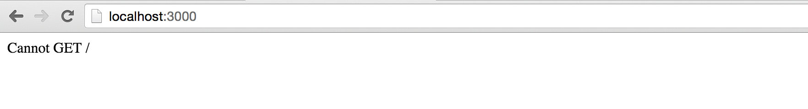

# Building a Simple CRUD Application with Express and MongoDB

I thought I'd document the basics for someone who wants to learn to build their first application with Node.

Blah Blah Blah

## CRUD, Express and MongoDB

CRUD, Express and MongoDB. All these terms are big words for one who has never touched any server-side programming in their lives. Let's quickly introduce what they are before we diving into the tutorial.

[Express](http://www.google.com) is a framework for building web applications on top of Node.js. It simplifies the server creation process that is already available in Node. In case you were wondering, Node allows you to use JavaScript as your server-side language.

[MongoDB]() is a database. Databases are where information related to your web application is stored.

[CRUD]() is an acronym for Create, Read, Update and Delete. CRUD is a set of operations we can get servers to execute (POST, GET, PUT and DELETE) respectively. Here is what each of these operations do in summary: 

- Create (POST) - Make something 
- Read (GET)_- Get something
- Update (PUT) - Change something
- Delete (DELETE)- Remove something

If we put CRUD, Express and MongoDB together into a single diagram, this is what it would look like:

<figure>
  
</figure>

Does CRUD, Express and MongoDB makes more sense to you now?

Great. Let's move on.

## Getting Started

We're going to build a simple list application that allows you to keep track of things within a list (like a Todo List for example).

This is where you can find the [finished code]() and a [live demo]().

Note: In case you were wondering, this isn't MVC yet. We're mainly focusing on how to use CRUD, Express and Mongo DB in this tutorial. MVC relies more on client-side JavaScript.

You'll need two things to get started with this tutorial:

1. You aren't afraid of typing commands into a shell. Check out [this article]() if you currently are.
2. You need to have [Node]() installed.

To check if you have Node installed, open up your command line and run the following code:

```bash
$ node -v
```

You should get a version number if you have Node installed. If you don't, you can install Node either by downloading the installer from Node's website or downloading it through package managers like [Homebrew]() (Mac) and [Chocolatey]() (Windows).

## Getting Started

Create a folder called `list-app` anywhere on your computer and navigate to it. Then, run the `npm init` command.

This command creates a `package.json` file that helps you manage dependencies that we will install into the application in a short while.

```bash
$ npm init
```

Just hit enter through everything that appears. I'll talk about the ones you need to know as we go through the tutorial.

## Running Node for the first time in your life

Since Node allows us to write JavaScript on the server-side, it also means we can execute JavaScript files without the use of browsers.

The simplest way to use node is to run the `node` command with a path to a file. Let's create a file called `server.js` to run node with.

```bash
$ touch server.js
```

When the execute the `server.js` file, we want to make sure it's running properly. To do so, simply write a `console.log` statement in `server.js`:

```javascript
console.log('May the Node be with you')
```

Now, run `node server.js` in your command line and you should see the statement you logged:

<figure>
  
</figure>

Great. Let's move on and learn how to use Express now.

## Using Express

We first have to install Express before we can use it in our application. Installation is easy, we can use the Node package manager (npm) which comes bundled with Node to install Express.

Run the `npm install express --save` command in your command line:

```bash
$ npm install express --save
```

Once you're done, you should see that npm has saved Express as a dependency in `package.json`.

<figure>
  
</figure>

Next, we use express in `server.js` by requiring *it*. This is also how you can use other packages you've installed with npm.

```javascript
const express = require('express');
const app = express();
```

One of the main things express helps us with is to create a server that browsers can connect to. We can use the `.listen` method that express provides to do so:

```javascript
app.listen(3000, function() {

})
```

Now, run `node server.js` and navigate to `localhost:3000` on your browser. You should see a message that says "cannot get /".

<figure>
  
</figure>

That's a good sign. It means we can now communicate to our express server through the browser. This is also the part where we begin CRUD operations. 

## CRUD - READ

The **READ** operation is performed by browsers whenever you visit a webpage. Under the hood, browsers sends a **GET** request to the server to perform a READ operation. The reason we see the "cannot get /" error is because we have yet to send anything back to the browser from our Express application. 

In Express, we receive a **GET** request with the `get` method:

```javascript
app.get(path, callback)
```

**The first argument, `path`**, is the path of the GET request. It's anything that comes after your domain name. 

When we're visiting `localhost:3000`, our browsers are actually looking for `localhost:3000/`. The path argument in our case now is `/`. 

**The second argument is a callback function** that tells the server what to do when the path is matched. It takes in two arguments, a request object and a response object: 

```javascript
app.get('/', function (request, response) {
  // do something here
})
```

For now, let's write "Hello World" back to the browser. We do so by using a `send` method that comes with the response object: 

```javascript
app.get('/', function(req, res) {
  res.send('Hello World')
})
// Note: request and response are usually written as req and res respectively.
```

I'm going to start writing in ES6 code and show you how to convert to ES6 along the way as well. First off, I'm replacing the `function()` with the [ES6 arrow function](). The below code is the same as the above code: 

```javascript
app.get('/', (req, res) => {
  res.send('hello world')
})
```

Now, restart your server by doing the following: 

1. Stop the current server by hitting `CTRL + C` in the command line. 
2. Run `node server.js` again. 

Then, navigate to `localhost:3000` on your browser. You should be able to see a string that says "Hello World". 

<figure>
  
</figure>

Great. Let's change our app so we serve an `index.html` page back to the browser instead. To do so, we use the `sendFile` method that's provided by the `res` object. 

```javascript
app.get('/', (req, res) => {
  res.sendFile('index.html')
})
```

We also have to create an `index.html` file in the root of our server. 

```bash
touch index.html
```

Let's put some text in our `index.html` file as well: 

```html
<!DOCTYPE html>
<html lang="en">
<head>
  <meta charset="UTF-8">
  <title>MY APP</title>
</head>
<body>
  May Node and Express be with you.   
</body>
</html>
```

Restart your server and refresh your browser. You should be able to see the results of your HTML file now.

<figure>
  
</figure>

That, in a nutshell, is how Express handles a **GET** request (**READ** operation). 

At this point, you'll notice that you'll restart your server whenever you make a change. That's a tedious process, so let's take a quick detour and streamline it by using a package called [nodemon](). 

## Enter Nodemon

Nodemon restarts the server automatically whenever you save a file that the server uses file. We can install Nodemon by using the following command: 

```bash
$ npm install nodemon --save-dev
```

Note: The reason we're using a `--save-dev` flag here is because we're only going to use Nodemon when developing applications. It's not going onto the production server. This flag would save Nodemon as a `devDependency` in your `package.json` file.

Moving on, Nodemon behaves the same way as node, which means we can run our server by calling `nodemon server.js`. Unfortunately, we can't do it in the command line straight away because Nodemon isn't available to our command line right now. We have to access the `node_modules` folder to execute the Nodemon package if we wanted to use it. The code looks like this:

```bash
$ ./node_modules/.bin/nodemon server.js
```

That's a handful to type. One way to make it simpler is to create a `script` key in `package.json`. 

```javascript
{
  // ... 
  "scripts": {
    "dev": "nodemon server.js"
  }
  // ...
}
```

You can then run `npm run dev` to trigger `nodemon server.js`. 

Now, back to the main topic. We're going to cover the **CREATE** operation next. 

## CRUD - CREATE

The **CREATE** operation isn't performed by browsers immediately. You have to trigger your browser to send in a **POST** request to the server. 


Note: This, of course, isn't the best example. We could create single page apps with JavaScript so we don't force users to refresh their browsers whenever there is a need to perform CRUD operations.

It however, forms a good base for those who are starting out with the backend side of things.
